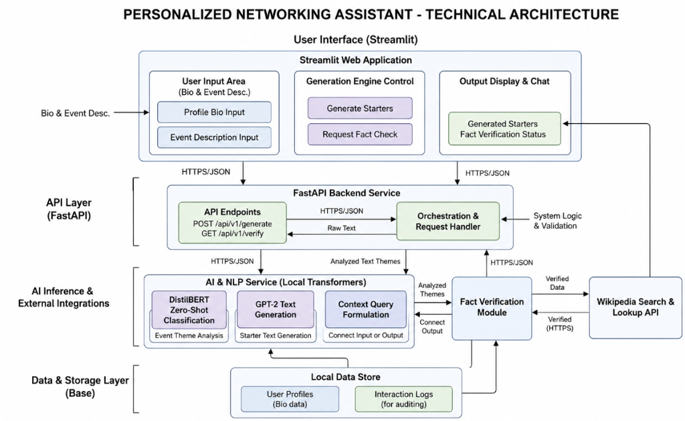

# Personalized Networking Assistant 🤝

[](https://www.python.org/downloads/)
[](https://fastapi.tiangolo.com)
[](https://streamlit.io)
[](LICENSE)



An AI-powered networking assistant that analyzes events, generates personalized conversation starters, and fact-checks topics — all running locally with open-source models.

---

## 📐 Architecture

```
┌─────────────────────────────────────────────────────────────────┐
│                    User Interface (Streamlit)                    │
│  ┌──────────────┐  ┌─────────────────────┐  ┌───────────────┐  │
│  │ Profile Bio  │  │  Generation Engine  │  │  Output &     │  │
│  │ Event Desc.  │  │  Generate Starters  │  │  Fact Status  │  │
│  └──────────────┘  │  Request Fact Check │  └───────────────┘  │
│                    └─────────────────────┘                      │
└─────────────────────────┬───────────────────────────────────────┘
                          │ HTTPS/JSON
┌─────────────────────────▼───────────────────────────────────────┐
│                   FastAPI Backend Service                        │
│  POST /analyze-event   POST /generate-conversation              │
│  GET  /fact-check      GET  /history      POST /feedback        │
└──────────────┬──────────────────────┬───────────────────────────┘
               │                      │
┌──────────────▼──────────────┐ ┌─────▼──────────────────────────┐
│   AI & NLP Services         │ │   Fact Verification Module      │
│  ┌──────────────────────┐   │ │   ┌───────────────────────────┐ │
│  │ BART Zero-Shot       │   │ │   │ Wikipedia Search & Lookup │ │
│  │ Classification       │   │ │   └───────────────────────────┘ │
│  ├──────────────────────┤   │ └────────────────────────────────┘
│  │ GPT-2 Text Generator │   │
│  ├──────────────────────┤   │ ┌────────────────────────────────┐
│  │ Context Formulator   │   │ │   Local Data Store (JSON)      │
│  └──────────────────────┘   │ │   history.json / profiles.json │
└─────────────────────────────┘ └────────────────────────────────┘
```

---

## ✨ Features

| Feature | Description |
|---|---|
| 🧠 **Event Analysis** | BART zero-shot classification of event themes |
| 💬 **Starter Generation** | GPT-2 powered personalized conversation starters |
| 🔎 **Fact Checking** | Wikipedia API verification with confidence levels |
| 📜 **History** | Paginated, searchable interaction history |
| ⭐ **Feedback** | Star rating and comment system per session |
| 📊 **Dashboard** | Analytics: theme trends, ratings, sessions over time |
| ⬇️ **Export** | Download history as JSON or CSV |
| 🎨 **Premium UI** | Dark-themed Streamlit app with gradient design |
| 🐳 **Docker Ready** | Multi-stage Dockerfile + Docker Compose |

---

## 🚀 Quick Start

### Prerequisites

- Python 3.11+
- ~4 GB RAM (for NLP models)
- Internet connection (first run downloads ~1 GB of model weights)

### 1. Clone & Install

```bash
git clone https://github.com/your-org/networking-assistant.git
cd networking-assistant

python -m venv venv
# Windows:
venv\Scripts\activate
# macOS/Linux:
source venv/bin/activate

pip install -r requirements.txt
```

### 2. Configure Environment

```bash
cp .env.example .env
# Edit .env if needed (defaults work out of the box)
```

### 3. Initialize Data Store

```bash
mkdir -p data
echo '[]' > data/history.json
echo '[]' > data/profiles.json
```

### 4. Start the Backend

```bash
uvicorn app.main:app --reload
```

API available at: http://localhost:8000  
Swagger UI: http://localhost:8000/docs

### 5. Start the Frontend

Open a **new terminal** in the project root:

```bash
streamlit run frontend/streamlit_app.py
```

Frontend available at: http://localhost:8501

---

## 🧪 Running Tests

```bash
# All tests with verbose output
pytest tests/ -v

# With coverage report
pytest tests/ -v --cov=app --cov-report=term-missing

# Coverage with HTML report
pytest tests/ -v --cov=app --cov-report=html:htmlcov
```

---

## 🐳 Docker Deployment

```bash
# Build and start all services
docker compose up -d

# View logs
docker compose logs -f

# Stop services
docker compose down
```

Services:
- Backend: http://localhost:8000
- Frontend: http://localhost:8501

---

## 📡 API Reference

### POST /api/v1/analyze-event

Classify a networking event into thematic categories.

```json
{
  "event_description": "NeurIPS 2024 — AI and machine learning conference...",
  "user_bio": "Senior ML Engineer specializing in NLP"
}
```

**Response:**
```json
{
  "session_id": "uuid-here",
  "themes": [{"label": "technology", "score": 0.92}, ...],
  "top_theme": "technology",
  "timestamp": "2024-07-03T10:00:00"
}
```

---

### POST /api/v1/generate-conversation

Generate personalized conversation starters.

```json
{
  "event_description": "A fintech summit...",
  "user_bio": "Product manager in financial services",
  "num_starters": 5
}
```

---

### GET /api/v1/fact-check?query=...&query=...

Fact-check one or more topics via Wikipedia.

```
GET /api/v1/fact-check?query=artificial+intelligence&query=machine+learning
```

---

### GET /api/v1/history?page=1&page_size=20&search=AI

Paginated session history with optional keyword search.

---

### POST /api/v1/feedback

Submit feedback for a session.

```json
{
  "session_id": "uuid-here",
  "rating": 5,
  "comment": "Excellent starters!"
}
```

---

## 🏗️ Project Structure

```
networking-assistant/
├── app/                        # FastAPI backend
│   ├── main.py                 # App factory & entry point
│   ├── config.py               # Settings (pydantic-settings)
│   ├── models/                 # Pydantic request/response models
│   ├── routers/                # Route handlers (one per endpoint group)
│   ├── services/               # Business logic services
│   │   ├── nlp_service.py      # BART zero-shot classification
│   │   ├── generation_service.py  # GPT-2 text generation
│   │   ├── factcheck_service.py   # Wikipedia API
│   │   ├── storage_service.py     # JSON persistence
│   │   └── orchestrator.py        # Coordination layer
│   └── utils/                  # Logger, custom exceptions
├── frontend/
│   ├── streamlit_app.py        # Main Streamlit UI
│   └── pages/
│       ├── dashboard.py        # Analytics dashboard
│       └── history.py          # History browser
├── tests/                      # pytest test suite
├── data/                       # Local JSON data store
├── Dockerfile                  # Multi-stage Docker build
├── docker-compose.yml          # Full stack deployment
├── Makefile                    # Developer convenience targets
├── requirements.txt
├── .env.example
├── README.md
├── CONTRIBUTING.md
└── CHANGELOG.md
```

---

## 🛠️ Tech Stack

| Layer | Technology |
|---|---|
| Frontend | Streamlit 1.35+ |
| Backend | FastAPI 0.111+ |
| NLP Classification | `facebook/bart-large-mnli` (HuggingFace) |
| Text Generation | `gpt2` (HuggingFace) |
| Fact Checking | Wikipedia API (`wikipedia-api`) |
| Data Persistence | Local JSON files |
| Testing | pytest + pytest-asyncio + pytest-cov |
| Containerization | Docker + Docker Compose |

---

## 📚 Documentation

| Document | Description |
|---|---|
| [docs/architecture_diagram.png](docs/architecture_diagram.png) | System architecture diagram |
| [docs/implementation_plan.md](docs/implementation_plan.md) | Detailed implementation plan |
| [docs/walkthrough.md](docs/walkthrough.md) | Build walkthrough & all files created |
| [docs/run_and_deploy.md](docs/run_and_deploy.md) | Full run & deployment guide |

---

## 📄 License

MIT License — see [LICENSE](LICENSE) for details.

---

## 🤝 Contributing

See [CONTRIBUTING.md](CONTRIBUTING.md) for development setup, coding standards, and PR process.
