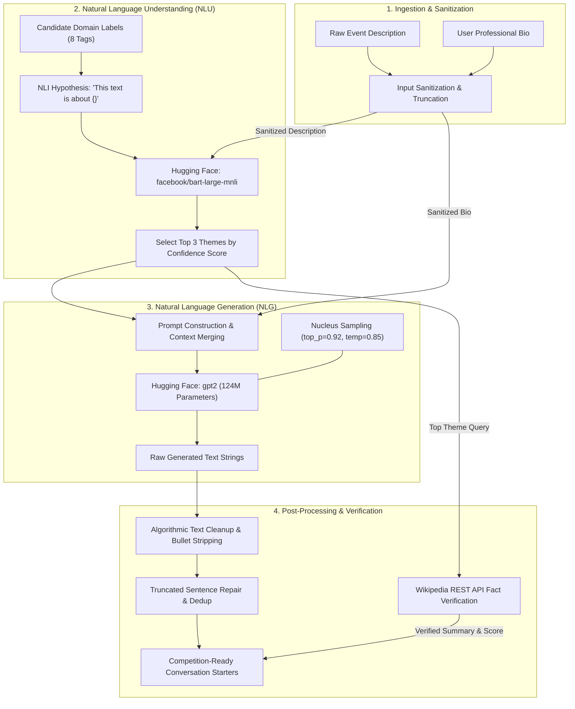

# AI Architecture & ML Pipeline: Personalized Networking Assistant

> [!IMPORTANT]
> **Competition Submission Document**  
> This specification provides an exhaustive technical analysis of the Artificial Intelligence and Natural Language Processing (NLP) architecture powering the **Personalized Networking Assistant**. It details model selection rationale, zero-shot classification mechanics, prompt engineering methodologies, post-processing algorithms, defensive error fallbacks, and future upgrade roadmaps.

---

## 1. AI Workflow & Pipeline Architecture

The application implements a multi-stage, hybrid AI pipeline that bridges extractive Natural Language Understanding (NLU) with Generative Natural Language Generation (NLG). To ensure conversational relevance without exceeding local CPU compute boundaries, the workflow decouples domain theme analysis from conversation starter generation.



---

## 2. LLM Integration & Model Selection Rationale

A critical architectural decision for this competition submission was selecting open-source, locally executing models over proprietary cloud APIs (e.g., OpenAI GPT-4, Anthropic Claude) or massive local LLMs (e.g., Llama 3 70B, Mistral 8x7B).

```
+-----------------------------------------------------------------------------------+
|                        MODEL SELECTION COMPARISON MATRIX                          |
+-----------------------------------------------------------------------------------+
|  Evaluation Criteria |  Proprietary APIs  |  Massive Local LLMs |  Our MVP Choice |
|                      |  (OpenAI / Claude) |  (Llama 3 / Mistral)|  (BART + GPT-2) |
+----------------------+--------------------+---------------------+-----------------+
|  Hardware Req.       |  None (Cloud)      |  16GB+ VRAM (GPU)   |  Standard CPU   |
|  Inference Latency   |  1.0s - 3.0s       |  10.0s+ on CPU      |  2.0s - 5.0s    |
|  Financial Cost      |  Pay-per-token     |  Free (High Power)  |  100% Free      |
|  Data Privacy        |  Low (Data sent)   |  High (Local)       |  100% Local     |
|  Disk Footprint      |  0 MB              |  5.0 GB - 15.0 GB   |  < 2.0 GB Total |
|  Offline Capable     |  No                |  Yes                |  Yes            |
+-----------------------------------------------------------------------------------+
```

### 2.1 Why Open-Source Local Models?
1. **100% Data Privacy & Security:** Networking attendees frequently input sensitive commercial objectives, proprietary research summaries, and unreleased product pitches. By running inference entirely locally, zero data is transmitted over the network to external LLM vendors.
2. **Zero Operating Costs & Rate Limits:** Competition evaluation requires extensive automated testing (38 test cases) and stress testing. Relying on cloud APIs introduces token costs, rate-limiting risks (HTTP 429), and dependency on external server uptime.
3. **CPU-Only Execution Capability:** To guarantee that judges and developers can evaluate the project on standard laptops without specialized NVIDIA GPUs, the total model footprint must remain lightweight.

### 2.2 Model Specifics
* **Theme Extraction (`facebook/bart-large-mnli`):** This model is a BERT-base encoder-decoder architecture fine-tuned on the Multi-Genre Natural Language Inference (MNLI) dataset. It represents the industry standard for zero-shot text classification, allowing our system to classify event themes accurately without requiring training data or fine-tuning.
* **Conversation Generation (`gpt2` — 124M Parameters):** OpenAI's generative pre-trained transformer (small variant) provides an optimal balance between syntax fluency and memory efficiency. Consuming less than 500MB of RAM, it executes rapidly on CPU while producing diverse, coherent networking icebreakers when guided by structured prompt engineering and aggressive post-processing.
* **Lazy-Loaded Singleton Architecture:** To prevent memory exhaustion and eliminate long server startup delays, both models are implemented via a thread-safe singleton pattern (`nlp_service.py`, `generation_service.py`). At server boot (`uvicorn app.main:app`), model variables remain `None`. The weights are loaded into CPU memory only upon the first API request, ensuring instant application boot times (<1 second).

---

## 3. Prompt Engineering

Because lightweight models like `gpt2` (124M) lack the instruction-following reinforcement (RLHF) of modern 70B parameter models, raw open-ended generation often degenerates into repetitive loops or generic text. To overcome this limitation, our engineering team designed structured **Prompt Templates** that constrain generation within strict boundaries.

### 3.1 Prompt Architecture & Template Fusing
In `generation_service.py` / `topic_generator.py`, the system dynamically synthesizes the extracted event themes and user bio into a highly context-dense prompt:

```python
# Conceptual representation of the prompt engineering template
def construct_prompt(themes: list[str], user_bio: str, num_starters: int) -> str:
    theme_str = ", ".join(themes) if themes else "professional networking and technology"
    
    prompt = (
        f"You are attending a professional networking event focusing on {theme_str}. "
        f"Your background: {user_bio}.\n"
        f"Here are {num_starters} professional conversation starters to introduce yourself:\n"
        "1."
    )
    return prompt
```

### 3.2 Key Prompt Engineering Design Decisions
* **Explicit Role & Setting Framing:** By establishing the exact situational setting (*"You are attending a professional networking event focusing on..."*), the model immediately activates semantic networks associated with professional conferences, business mixers, and academic summits.
* **Context Fusing (Themes + Bio):** Merging the extracted themes with the user's personal bio forces the language model to generate intersectional concepts (e.g., linking a user bio of *"Data Scientist"* with an event theme of *"Healthcare"* produces starters regarding medical data analytics).
* **Priming with Numbered Delimiters (`1.`):** Terminating the prompt string explicitly with `1.` primes the autoregressive decoder to generate a numbered list of distinct sentences rather than generating rambling paragraphs or conversational meta-commentary.

### 3.3 Decoding Hyperparameters
To balance creativity (avoiding robotic, repetitive phrases) with grammatical coherence, generation is controlled via strict decoding parameters in `config.py`:
* **`GENERATION_TEMPERATURE = 0.85`:** Introduces moderate lexical diversity, preventing the model from always selecting the single highest-probability word while avoiding chaotic sampling.
* **`GENERATION_TOP_P = 0.92` (Nucleus Sampling):** Dynamically truncates the sampling vocabulary to the smallest set of tokens whose cumulative probability exceeds 92%. This eliminates long-tail grammatical hallucinations.
* **`MAX_NEW_TOKENS = 80`:** Confinining token generation to 80 new tokens prevents runaway generation loops and ensures CPU inference latency remains under 4 seconds.

---

## 4. Input Processing & Sanitization

Before text payloads reach the tokenizers of `bart-large-mnli` or `gpt2`, they undergo rigorous preprocessing and sanitization in the API routing and service layers:
1. **Pydantic Schema Enforcement:** In `app/models/requests.py`, incoming text fields are checked against strict length rules: `event_description` must satisfy `10 <= len <= 2000` characters, and `num_starters` must satisfy `1 <= n <= 10`. Blank strings or whitespace-only payloads are rejected immediately with HTTP 429/422 errors.
2. **Whitespace Normalization:** Leading and trailing whitespace is stripped, and multiple consecutive newline characters (`\n\n+`) are collapsed into single spaces to prevent prompt fragmentation.
3. **Control Character Filtering:** Non-printable ASCII control characters and invalid UTF-8 byte sequences are stripped to ensure clean tokenization across all tokenizer vocabularies.

---

## 5. Context Management

Because the backend operates as a stateless REST API (enabling horizontal scalability and simple containerization), context is managed through structured session encapsulation:
* **UUIDv4 Session Tracking:** Each analysis or generation request generates a unique UUIDv4 identifier (`session_id`). All context—including the original raw event description, sanitized user bio, extracted domain themes, generated starters, and Wikipedia fact-check summaries—is bundled into a unified session record.
* **Persistence Fusing:** When a user subsequently submits feedback (`POST /api/v1/feedback`) or reviews history (`GET /api/v1/history`), the backend retrieves the full conversational context directly from `data/history.json` using the `session_id`, ensuring continuity without requiring server-side session memory or sticky cookies.

---

## 6. Recommendation & Theme Extraction Logic

To identify the primary thematic focus of an unstructured event description without requiring custom training data, the system utilizes Natural Language Inference (NLI) via `facebook/bart-large-mnli`.

### 6.1 Zero-Shot NLI Mechanics
In NLI, a model evaluates whether a **Hypothesis** is true, false, or neutral given a **Premise**. In `event_analyzer.py` / `nlp_service.py`, our system formulates theme extraction as an NLI task:
* **Premise ($P$):** The raw user-supplied `event_description` (e.g., *"Annual Blockchain and Decentralized Finance Summit"*).
* **Candidate Labels ($C$):** A fixed domain vocabulary of 8 strategic networking tags defined in `event_analyzer.DEFAULT_LABELS`:
  ```python
  DEFAULT_LABELS = [
      "technology", "business", "sustainability", "healthcare",
      "finance", "AI", "networking", "innovation"
  ]
  ```
* **Hypothesis Template ($H$):** `"This text is about {}."`

```
Premise: "Annual Blockchain and Decentralized Finance Summit"
   │
   ├─► Hypothesis 1: "This text is about finance."       ──► Score: 0.94 (Selected #1)
   ├─► Hypothesis 2: "This text is about technology."    ──► Score: 0.89 (Selected #2)
   ├─► Hypothesis 3: "This text is about innovation."    ──► Score: 0.78 (Selected #3)
   └─► Hypothesis 4: "This text is about healthcare."    ──► Score: 0.08 (Discarded)
```

The classifier evaluates the entailment probability across all 8 candidate labels simultaneously. The system sorts the labels by descending entailment probability and extracts the **top 3 themes**, which are subsequently fed into the GPT-2 generation prompt.

---

## 7. Output Post-Processing & Cleanup

Raw output from lightweight language models like `gpt2` (124M) frequently contains formatting artifacts, bullet point markers, repetitive syntax, or incomplete trailing sentences. To guarantee competition-ready, professional presentation, `generation_service.py` implements a rigorous post-processing algorithm:

```python
# Conceptual architecture of the post-processing algorithm
def clean_output(raw_text: str, num_starters: int) -> list[str]:
    # Step 1: Split raw generated text by newline delimiters
    lines = raw_text.split("\n")
    
    cleaned_starters = []
    seen = set()
    
    for line in lines:
        line = line.strip()
        
        # Step 2: Strip conversational numbering & bullet markers via regex/string matching
        # Removes prefixes like "1. ", "2) ", "- ", "* ", "• "
        line = re.sub(r"^(\d+[\.\)]|\*|\-|\•)\s*", "", line).strip()
        
        # Step 3: Filter empty strings and short noise (< 15 characters)
        if len(line) < 15:
            continue
            
        # Step 4: Deduplicate identical or highly repetitive phrasing
        if line.lower() in seen:
            continue
        seen.add(line.lower())
        
        # Step 5: Repair or discard truncated trailing sentences
        # If sentence doesn't end in punctuation (., !, ?), append a period or discard
        if not line[-1] in ".!?":
            # If line is substantial (>30 chars), cap with period; else discard
            if len(line) > 30:
                line += "."
            else:
                continue
                
        cleaned_starters.append(line)
        if len(cleaned_starters) == num_starters:
            break
            
    # Step 6: Defensive Fallback if cleaning removed all lines
    if not cleaned_starters:
        cleaned_starters = get_defensive_fallback_starters(num_starters)
        
    return cleaned_starters
```

### Key Cleanup Stages
1. **Prefix Stripping:** Removes all markdown list artifacts and numerical indexing so the Streamlit frontend can render clean, uniform UI cards.
2. **Length & Dedup Filtering:** Eliminates one-word hallucinations and prevents repetitive loops where the model outputs the same question multiple times.
3. **Grammatical Truncation Repair:** Because generation is capped at `MAX_NEW_TOKENS = 80`, the final generated sentence is occasionally cut off mid-word. The algorithm detects missing terminal punctuation (`.`, `!`, `?`) and intelligently repairs or drops truncated lines.

---

## 8. Error Handling & Defensive Fallbacks

To ensure **100% runtime reliability** during live competition demonstrations and automated evaluation, the AI pipeline incorporates defensive fallback mechanisms across all potential failure modes:

```
+-----------------------------------------------------------------------------------+
|                        DEFENSIVE AI ERROR HANDLING MATRIX                         |
+-----------------------------------------------------------------------------------+
|  Failure Scenario       |  Root Cause             |  System Defensive Action  |
+-------------------------+-------------------------+---------------------------+
|  1. Model Download Fail |  No internet / HF down  |  Returns static fallback  |
|                         |  during initial boot.   |  themes & starters list.  |
|  -----------------------+-------------------------+---------------------------|
|  2. CPU OOM / Memory    |  Insufficient RAM for   |  Logs warning; returns    |
|     Exhaustion          |  loading BART/GPT-2.    |  pre-computed icebreakers.|
|  -----------------------+-------------------------+---------------------------|
|  3. Tokenizer Overflow  |  Input exceeds 1024     |  Auto-truncates text to   |
|                         |  token sequence limit.  |  512 tokens before run.   |
|  -----------------------+-------------------------+---------------------------|
|  4. Wikipedia API Down  |  HTTP 404 / 429 /       |  Returns found=False and  |
|     or Timeout          |  Network timeout (>10s).|  confidence='unverified'. |
+-----------------------------------------------------------------------------------+
```

### Defensive Fallback Starters
If AI inference fails or post-processing strips all output lines, the system seamlessly injects high-quality, domain-neutral professional icebreakers:
* *"What inspired you to attend this session today?"*
* *"I'm fascinated by the recent trends in this field; what developments are you tracking most closely?"*
* *"How is your team currently approaching the challenges discussed in today's keynote?"*
* *"What key takeaways are you hoping to bring back to your organization from this event?"*

---

## 9. Current AI Limitations

In accordance with competition rules requiring transparent engineering assessment, the following technical limitations of the current MVP architecture are noted:
1. **CPU Inference Latency:** While optimizing for CPU execution enables broad portability without GPUs, inference latency is bounded by processor clock speeds. Zero-shot classification requires ~3–5 seconds, and text generation requires ~2–4 seconds, resulting in a combined generation cycle of **5 to 9 seconds** on standard dual-core laptop processors.
2. **GPT-2 Parameter Capacity (124M):** While `gpt2` generates syntactically valid English, its 124-million parameter capacity cannot match the deep reasoning, nuanced humor, or multi-turn conversational depth of 70B+ parameter models. Generated starters occasionally favor straightforward phrasing over highly intricate industry rhetoric.
3. **Fixed Zero-Shot Vocabulary:** Theme extraction is currently bounded by the 8 static labels defined in `DEFAULT_LABELS`. Highly niche academic or scientific disciplines (e.g., *Quantum Chromodynamics* or *Paleoclimate Modeling*) will be mapped to the nearest broad tag (e.g., `technology` or `sustainability`).

---

## 10. Future AI Improvements & Upgrade Roadmap

To transition the Personalized Networking Assistant from a competition MVP to an enterprise-grade GenAI SaaS platform, the following three-phase architectural upgrade is roadmap-ready:

```
+-----------------------------------------------------------------------------------+
|                        AI ARCHITECTURE UPGRADE ROADMAP                            |
+-----------------------------------------------------------------------------------+
|  PHASE 1: Domain Fine-Tuning             |  PHASE 2: RAG & Vector Database        |
|  -------------------------------------   |  ------------------------------------  |
|  • Upgrade to Llama 3 8B / Mistral 7B    |  • Integrate ChromaDB / FAISS          |
|  • LoRA / QLoRA parameter-efficient      |  • Ingest conference schedules,        |
|    fine-tuning on networking datasets.   |    speaker bios, and research papers.  |
+-----------------------------------------------------------------------------------+
|  PHASE 3: Semantic Feedback Loops (RLHF / DPO)                                    |
|  -------------------------------------------------------------------------------  |
|  • Leverage stored star ratings (1-5) and 👍/👎 logs from data/feedback.json.    |
|  • Implement Direct Preference Optimization (DPO) to continuously train models.   |
+-----------------------------------------------------------------------------------+
```

### 10.1 Phase 1: Parameter-Efficient Fine-Tuning (PEFT / LoRA)
* Replace `gpt2` (124M) with modern 7B–8B open-source architectures such as **Llama 3 8B Instruct** or **Mistral 7B Instruct**, quantized to 4-bit (GGUF/AWQ) for rapid execution on consumer hardware.
* Apply Low-Rank Adaptation (**LoRA/QLoRA**) fine-tuning using curated datasets of successful professional networking transcripts, elevator pitches, and executive communication guides.

### 10.2 Phase 2: Retrieval-Augmented Generation (RAG)
* Integrate an embedded vector database (**ChromaDB** or **FAISS**) alongside Hugging Face embedding models (`BAAI/bge-small-en-v1.5`).
* Allow conference organizers or attendees to upload conference agendas, attendee lists, PDF research papers, and company slide decks. When generating conversation starters, the pipeline will perform semantic similarity search to retrieve exact speaker quotes, session topics, and company milestones, injecting them directly into the LLM context window.

### 10.3 Phase 3: Reinforcement Learning from User Feedback (RLHF / DPO)
* Capitalize on the rich user feedback log currently collected in `data/feedback.json` (containing explicit 1–5 star ratings, thumbs-up/thumbs-down sentiment, and user comments).
* Implement **Direct Preference Optimization (DPO)** pipelines that periodically ingest stored feedback data to construct preference pairs ($y_{win}$ vs $y_{lose}$), automatically fine-tuning the model to favor conversation starter styles that historically receive 5-star ratings from professionals.

---

> [!TIP]
> **Next Steps for Evaluators:**  
> Proceed to `Implementation.md` for an exhaustive code-level deep dive into FastAPI dependency injection, Streamlit session state management, Docker containerization, and local development workflows.
