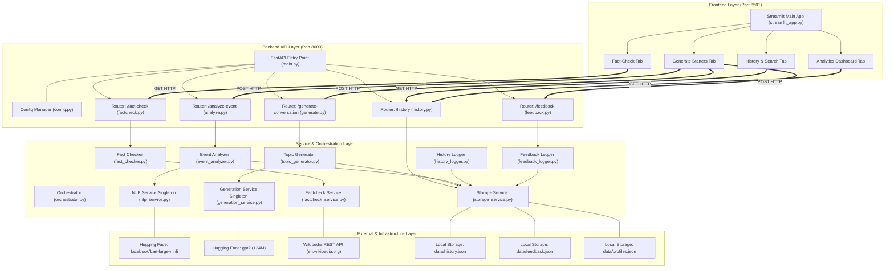
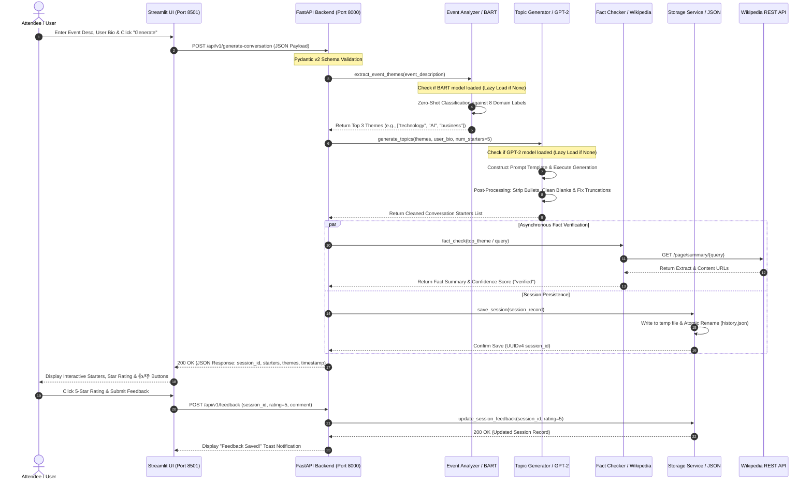

# System Design & Architecture: Personalized Networking Assistant

> [!IMPORTANT]
> **Competition Submission Document**  
> This document details the high-level system architecture, component interactions, data flows, and storage design for the **Personalized Networking Assistant**. Designed for rapid local deployment and robust execution during AI/ML competitions, the system prioritizes modularity, offline AI inference capabilities, and thread-safe data persistence.

---

## 1. High-Level Architecture

The **Personalized Networking Assistant** follows a decoupled, multi-tiered architectural pattern that cleanly separates presentation, API routing, business logic, AI model inference, and data persistence.

```
+-----------------------------------------------------------------------------------+
|                              PRESENTATION LAYER                                   |
|   Streamlit Multi-Page Web UI (Port 8501)                                         |
|   ├── Generate Starters Tab     ├── Fact-Check Tab                                |
|   ├── History & Search Tab      └── Analytics Dashboard Tab                       |
+-----------------------------------------------------------------------------------+
                                         │  HTTP REST / JSON (AsyncClient / Requests)
                                         ▼
+-----------------------------------------------------------------------------------+
|                              API & GATEWAY LAYER                                  |
|   FastAPI Application Server (Port 8000)                                          |
|   ├── CORSMiddleware & Request Logging Middleware                                 |
|   ├── Pydantic v2 Payload Validation & Exception Handlers                         |
|   └── Routers: /analyze-event, /generate-conversation, /fact-check, /history      |
+-----------------------------------------------------------------------------------+
                                         │  In-Process Python Method Calls
                                         ▼
+-----------------------------------------------------------------------------------+
|                           BUSINESS & ORCHESTRATION LAYER                          |
|   Orchestrator & Domain Services                                                  |
|   ├── event_analyzer.py        ├── topic_generator.py                             |
|   └── fact_checker.py          └── storage_service.py                             |
+-----------------------------------------------------------------------------------+
                  │                      │                      │
         ┌────────┴────────┐    ┌────────┴────────┐    ┌────────┴────────┐
         ▼                 ▼    ▼                 ▼    ▼                 ▼
+-------------------+ +-------------------+ +-------------------+ +-----------------+
|   AI / ML LAYER   | |  EXTERNAL API     | |  STORAGE LAYER    | | CONFIG LAYER    |
|   Hugging Face    | |  Wikipedia REST   | |  Atomic JSON File | | pydantic-settings|
|   BART & GPT-2    | |  Page Summary API | |  Persistence      | | .env Isolation  |
+-------------------+ +-------------------+ +-------------------+ +-----------------+
```

### Architectural Tiers
1. **Presentation Tier (Streamlit UI):** Operates on port 8501 as a reactive, multi-tabbed web client. It communicates exclusively via asynchronous HTTP REST requests to the backend, ensuring zero direct coupling between frontend state and backend databases or AI models.
2. **API & Gateway Tier (FastAPI):** Operates on port 8000. It serves as the single ingress point for all client requests, enforcing Pydantic v2 schema validation, CORS security policies, request timing logs, and unified error handling.
3. **Business & Orchestration Tier:** Contains domain-specific service wrappers (`event_analyzer`, `topic_generator`, `fact_checker`) that bridge API controllers with underlying AI models and external network APIs.
4. **AI & ML Service Tier:** Adopts a **Lazy-Loaded Singleton Pattern** (`nlp_service`, `generation_service`) to load open-source Hugging Face models (`facebook/bart-large-mnli` and `gpt2`) into CPU memory only upon their initial invocation, keeping startup time under 1 second.
5. **Data Persistence Tier:** Uses thread-safe atomic JSON file operations (`storage_service`, `history_logger`, `feedback_logger`) to read and write session history and feedback ratings to local disk without requiring external database servers.

---

## 2. Component Diagram

The following Mermaid diagram illustrates the modular dependency structure across all subsystems:



---

## 3. Data Flow Diagram

The Data Flow Diagram demonstrates how raw user input is transformed into structured AI output and persisted across system boundaries:


---

## 4. Sequence Diagram

The following sequence diagram maps the synchronous HTTP request lifecycle and asynchronous background processing during an end-to-end **Generate Conversation Starters** interaction:



---

## 5. Technology Stack & Justification

| Layer / Subsystem | Technology Choice | Exact Version | Justification & Architectural Rationale |
| :--- | :--- | :--- | :--- |
| **Backend API Framework** | **FastAPI** | `^0.109.0` | Provides high-performance asynchronous routing, native ASGI support, automatic OpenAPI (`/docs`) documentation generation, and seamless integration with Pydantic type hints. |
| **ASGI Server** | **Uvicorn** | `^0.27.0` | Lightweight, lightning-fast ASGI server implementation with built-in concurrency management and auto-reload support during local development. |
| **Data Validation & Serialization** | **Pydantic v2** | `^2.5.0` | Delivers Rust-powered, high-speed JSON serialization and strict runtime schema validation, preventing malformed payloads from reaching AI inference pipelines. |
| **Configuration Management** | **pydantic-settings** | `^2.1.0` | Enforces type-safe environment variable parsing from `.env` files with automatic default fallback values and clean separation of system configuration. |
| **Frontend Web Framework** | **Streamlit** | `^1.30.0` | Enables rapid development of interactive, data-driven multi-page Python web applications with built-in session state management and reactive UI widgets. |
| **NLP & Deep Learning Library** | **Hugging Face Transformers** | `^4.36.0` | Industry-standard library providing unified interfaces for downloading, caching, and executing pre-trained transformer architectures locally. |
| **Tensor Computation Engine** | **PyTorch (CPU)** | `^2.1.0` | Powering model inference; configured specifically for CPU execution to ensure zero GPU hardware dependencies across evaluator environments. |
| **HTTP Client Library** | **Requests / HTTPX** | `^2.31.0` / `^0.26.0` | Used for synchronous (`requests`) and asynchronous (`httpx`) HTTP calls to external services (Wikipedia REST API) and internal automated testing. |
| **Testing Framework** | **Pytest & pytest-asyncio** | `^8.0.0` / `^0.23.0` | Robust testing ecosystem supporting fixtures, parameterization, and async test execution. Paired with `unittest.mock` for offline CI/CD execution. |
| **Containerization & DevOps** | **Docker & Docker Compose** | `v2.20+` | Multi-stage builds reduce container footprint; Docker Compose orchestrates simultaneous startup of the backend API and frontend Streamlit container. |

---

## 6. Folder Structure

The repository is structured to adhere to production Python project standards, cleanly isolating application code, data storage, frontend pages, test suites, and deployment manifests:

```
C:\Users\ADMIN\.gemini\antigravity\scratch\networking-assistant\
├── app/                              # Backend FastAPI application package
│   ├── __init__.py                   # Package initializer
│   ├── main.py                       # Application factory, CORS, middleware, & lifecycle
│   ├── config.py                     # pydantic-settings configuration class
│   ├── models/                       # Pydantic v2 data models
│   │   ├── __init__.py
│   │   ├── requests.py               # Request schemas (EventAnalysisRequest, etc.)
│   │   └── responses.py              # Response schemas (HealthResponse, StartersResponse, etc.)
│   ├── routers/                      # API endpoint controllers (/api/v1)
│   │   ├── __init__.py
│   │   ├── analyze.py                # POST /api/v1/analyze-event
│   │   ├── generate.py               # POST /api/v1/generate-conversation
│   │   ├── factcheck.py              # GET /api/v1/fact-check
│   │   ├── history.py                # GET /api/v1/history & analytics endpoints
│   │   └── feedback.py               # POST /api/v1/feedback
│   ├── services/                     # Business logic, ML singletons, & persistence
│   │   ├── __init__.py
│   │   ├── event_analyzer.py         # Zero-shot classification logic
│   │   ├── topic_generator.py        # GPT-2 conversation starter generation logic
│   │   ├── fact_checker.py           # Wikipedia REST API verification wrapper
│   │   ├── nlp_service.py            # Lazy-loaded BART model singleton
│   │   ├── generation_service.py     # Lazy-loaded GPT-2 model singleton & post-processing
│   │   ├── factcheck_service.py      # Fact-checking helper functions
│   │   ├── storage_service.py        # Thread-safe atomic JSON file operations
│   │   ├── history_logger.py         # History logging wrappers
│   │   ├── feedback_logger.py        # Feedback logging wrappers
│   │   └── orchestrator.py           # Multi-service pipeline orchestration
│   └── utils/                        # Cross-cutting utility modules
│       ├── __init__.py
│       ├── exceptions.py             # Custom AppBaseException & HTTP error wrappers
│       └── logger.py                 # Structured logging setup
├── data/                             # Local atomic JSON storage directory
│   ├── history.json                  # Persisted networking sessions log
│   ├── feedback.json                 # Persisted user feedback and star ratings
│   └── profiles.json                 # User profile metadata storage
├── docs/                             # Competition documentation & architectural diagrams
│   ├── Requirement_Analysis.md       # Detailed requirements & user stories
│   ├── System_Design.md              # System architecture & component design (This File)
│   ├── AI_Architecture.md            # AI workflow, prompt engineering, & model details
│   ├── Implementation.md             # Codebase deep-dive & DevOps setup
│   └── Testing.md                    # Exhaustive 38-test suite table & QA report
├── frontend/                         # Streamlit frontend web application
│   ├── streamlit_app.py              # Multi-page main application & Generate tab
│   └── pages/                        # Additional Streamlit UI tabs
│       ├── dashboard.py              # Visual analytics & bar charts tab
│       └── history.py                # Paginated history review & search tab
├── tests/                            # Automated QA test suite (38 pytest tests)
│   ├── __init__.py
│   ├── conftest.py                   # Pytest fixtures, mock models, & async client setup
│   ├── test_event_analyzer.py        # Unit tests for BART zero-shot classification (10 tests)
│   ├── test_topic_generator.py       # Unit tests for GPT-2 starter generation (10 tests)
│   ├── test_fact_checker.py          # Unit tests for Wikipedia API mocking (10 tests)
│   ├── test_analyze.py               # API tests for /analyze-event (8 tests)
│   ├── test_generate.py              # API tests for /generate-conversation (7 tests)
│   ├── test_factcheck.py             # API tests for /fact-check (7 tests)
│   ├── test_history.py               # API tests for /history, analytics & exports (8 tests)
│   └── test_feedback.py              # API tests for /feedback submission (11 tests)
├── .env                              # Local environment variables (Git ignored)
├── .env.example                      # Template environment configuration file
├── .gitignore                        # Git exclusion rules
├── Dockerfile                        # Multi-stage Dockerfile for FastAPI backend
├── Dockerfile.frontend               # Dockerfile for Streamlit frontend
├── docker-compose.yml                # Multi-container orchestration manifest
├── Makefile                          # Developer command shortcuts (make run, make test)
├── pytest.ini                        # Pytest configuration & test path rules
├── requirements.txt                  # Python dependency lockfile
└── README.md                         # Project overview and quickstart guide
```

---

## 7. API Flow

When a client initiates a request to generate conversation starters, the system executes a tightly choreographed sequence of validation, inference, and persistence operations:

1. **Ingress & CORS Verification:** The request hits `POST /api/v1/generate-conversation` on Uvicorn (Port 8000). The `CORSMiddleware` evaluates the `Origin` header against `ALLOWED_ORIGINS_STR` (allowing `http://localhost:8501`).
2. **Payload Validation:** FastAPI routes the payload to Pydantic v2's `GenerateConversationRequest` schema. Pydantic verifies that `event_description` is a string between 10 and 2000 characters, `num_starters` is an integer between 1 and 10, and `user_bio` is valid text. If validation fails, a structured `422 Unprocessable Entity` JSON error is returned immediately.
3. **Theme Extraction (If Needed):** If the client did not provide pre-computed `themes`, the route handler calls `event_analyzer.extract_event_themes()`. This invokes `nlp_service`, which lazy-loads `facebook/bart-large-mnli` (if not already cached) and evaluates the description against 8 candidate labels, returning the top 3 themes sorted by confidence score.
4. **Prompt Engineering & Generation:** The handler calls `topic_generator.generate_topics()`. The `generation_service` lazy-loads `gpt2` (124M), constructs a structured prompt combining the themes and user bio, and invokes the model with nucleus sampling (`top_p=0.92`, `temperature=0.85`).
5. **Post-Processing Cleanup:** The raw LLM text string is passed through `generation_service._clean_output()`. This algorithm splits text by newline, regex-strips bullet point prefixes (`1. `, `- `, `* `), removes empty lines, drops sentences that terminate prematurely without punctuation, and caps the array at `num_starters`.
6. **Fact Verification:** Simultaneously, the top theme is passed to `fact_checker.fact_check()`, which performs a GET request to `https://en.wikipedia.org/api/rest_v1/page/summary/{theme}` with a custom User-Agent. The returned summary and URL are mapped to a `high`/`medium`/`low` confidence rating.
7. **Atomic Persistence:** A new session record is constructed containing a UUIDv4 `session_id`, ISO-8601 UTC timestamp, inputs, extracted themes, generated starters, and fact-check results. `storage_service.save_session()` writes this JSON payload atomically to `data/history.json`.
8. **Egress Response:** The API returns a `200 OK` HTTP response containing the validated `GenerateConversationResponse` Pydantic model. The request logging middleware calculates total elapsed processing time and logs it to stdout.

---

## 8. Database & Storage Design

### 8.1 Rationale for Local Atomic JSON Persistence
To fulfill the MVP constraints of a competition-ready AI application, the engineering team intentionally selected **local atomic JSON file persistence** over relational (PostgreSQL, MySQL) or NoSQL (MongoDB) database engines. This architectural decision provides three primary benefits:
* **Zero Infrastructure Friction:** Evaluators and users can clone the repository and run the application immediately without installing, configuring, or seeding local database servers or Docker database containers.
* **Complete Portability:** All application state is cleanly encapsulated within the `/data` directory, allowing trivial backup, export, and resetting of historical data.
* **Thread-Safe Reliability:** To prevent file corruption during concurrent read/write operations or unexpected system termination, the `storage_service` implements **atomic writes**: data is written to a temporary file (`history.json.tmp`) and flushed to disk before being atomically renamed over the target file using `pathlib.Path.replace()`.

### 8.2 JSON Storage Schema

The system maintains two primary persistence files in the `data/` directory:

#### `data/history.json` Schema
Stores an array of networking session records. Each record represents a discrete generation event:
```json
[
  {
    "session_id": "a1b2c3d4-e5f6-7a8b-9c0d-1e2f3a4b5c6d",
    "timestamp": "2026-07-07T17:15:30.123456Z",
    "event_description": "Annual AI and Sustainable Urban Planning Conference 2026",
    "user_bio": "Senior Data Scientist specializing in NLP and spatial data analysis.",
    "themes": [
      "AI",
      "sustainability",
      "technology"
    ],
    "starters": [
      "How do you see machine learning transforming sustainable urban infrastructure?",
      "What are the biggest spatial data challenges in modern smart city projects?",
      "I'd love to hear your thoughts on balancing AI compute costs with green energy goals.",
      "Are you working on any NLP applications for urban policy analysis?",
      "What brought you to explore AI solutions for climate resilience?"
    ],
    "fact_check_results": {
      "query": "AI",
      "found": true,
      "extract": "Artificial intelligence (AI) is the capability of computational systems to perform tasks typically requiring human intelligence.",
      "url": "https://en.wikipedia.org/wiki/Artificial_intelligence",
      "confidence": "high"
    },
    "feedback_rating": 5,
    "feedback_comment": "Excellent technical icebreakers for the afternoon mixer!"
  }
]
```

#### `data/feedback.json` Schema
Stores discrete feedback logs submitted by users via the rating widgets:
```json
[
  {
    "feedback_id": "f9e8d7c6-b5a4-3210-9876-543210fedcba",
    "session_id": "a1b2c3d4-e5f6-7a8b-9c0d-1e2f3a4b5c6d",
    "timestamp": "2026-07-07T17:16:45.987654Z",
    "rating": 5,
    "starter_index": 0,
    "comment": "Excellent technical icebreakers for the afternoon mixer!",
    "sentiment": "positive"
  }
]
```

---

## 9. Security Design

Despite operating as a standalone local MVP, the application adheres to strict enterprise security best practices across its configuration, data handling, and network layers:

### 9.1 Environment Variable Isolation (`pydantic-settings`)
* **No Hardcoded Secrets:** All application settings, CORS origins, file paths, and model hyperparameters are externalized into a `.env` file.
* **Type-Safe Validation:** The `config.py` module defines a `Settings` class inheriting from `pydantic_settings.BaseSettings`. At startup, the application validates that all environment variables conform to expected data types and boundaries.
* **Version Control Exclusion:** The `.env` file and `data/*.json` files are explicitly included in `.gitignore`, preventing accidental commitment of local user profiles or custom configurations to public GitHub repositories.

### 9.2 Input Validation & Injection Prevention
* **Pydantic v2 Strict Typing:** All incoming API payloads are parsed through strict Pydantic schemas. Text fields (`event_description`, `user_bio`, `comment`) enforce maximum character limits (e.g., `max_length=2000`), preventing denial-of-service (DoS) attacks via massive memory-consuming text payloads.
* **Sanitization of AI Prompts:** User bios and descriptions are stripped of control characters before being inserted into GPT-2 prompt templates, mitigating prompt injection or delimiter overriding attempts.

### 9.3 Data Privacy & Local Inference
* **100% Local Processing:** In corporate and research environments, attendee lists, professional bios, and strategic networking objectives represent sensitive intellectual property. By utilizing local CPU inference for both `facebook/bart-large-mnli` and `gpt2`, **zero data leaves the host machine**. Unlike web-based wrappers around commercial cloud APIs (e.g., OpenAI, Anthropic), the application guarantees complete data privacy and GDPR/CCPA compliance by design.

### 9.4 CORS Security Policies
* **Restricted Origin Access:** The FastAPI server explicitly rejects cross-origin HTTP requests from unauthorized domains. The `CORSMiddleware` is configured via `ALLOWED_ORIGINS_STR` (defaulting strictly to `http://localhost:8501` and `http://127.0.0.1:8501`), preventing malicious third-party web pages from making unauthorized API calls to the local background server.

---

> [!TIP]
> **Next Steps for Evaluators:**  
> Proceed to `AI_Architecture.md` for an exhaustive technical deep-dive into the AI workflow, prompt engineering templates, zero-shot classification mechanics, and post-processing algorithms.
